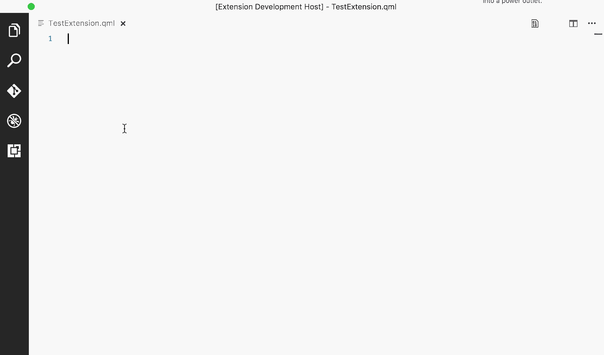

# QML Snippets for [Visual Studio Code](https://code.visualstudio.com/)

This extension for Visual Studio Code adds snippets for the [QML](http://www.qt.io/) language (Qt Meta-object Language).

The extension is based on the Sublime QML extension by Sergey Kozlov: 
https://github.com/skozlovf/Sublime-QML

## Usage
Type part of a snippet, press `enter`, and the snippet unfolds.

### QML Snippets
| Trigger                | Content |
| :-------               | :------- |
|alias                   |	property alias name :val|
|anchors                 |	anchors. :parent.
|anchors (all sides)     |	anchors.left: parent.left anchors.top: parent.top anchors.right: parent.right anchors.bottom: parent.bottom
|anchors.centerIn        |	anchors.centerIn: parent
|anchors.fill            |	anchors.fill: parent
|anchors.horizontalCenter|	anchors.horizontalCenter: parent.horizontalCenter
|anchors.margins         |	anchors.margins: 0
|anchors.verticalCenter  |	anchors.verticalCenter: parent.verticalCenter
|color                   |	color: \"#\"
|component.onCompleted:  |	Component.onCompleted: 
|connections             |	Connections {\n    target: \n    on \n
|console.log             |	console.log(" :")
|console.log + var       |	console.log(" :" + var)
|function                |	function name(argument) { &nbsp;    // body... }
|layout                  |	Layout.fillWidth: true\nLayout.fillHeight: :true
|layout.fillHeight       |	Layout.fillHeight: true
|layout.fillWidth        |	Layout.fillWidth: true
|mouse                   |	MouseArea { &nbsp;    anchors.fill: parent &nbsp;    cursorShape: Qt.PointingHandCursor &nbsp;    hoverEnabled: false &nbsp;    onEntered: { &nbsp;    onExited: { &nbsp;    onWheel: { &nbsp;    onClicked:  }
|property                |	property var name
|default property        |	default property var name
|readonly property       |	readonly property var name:
|QtObject                |	QtObject { &nbsp;    id: }
|Rectangle               |	Rectangle { &nbsp;    width: 10 &nbsp;    height: 10 &nbsp;    color: transparent }
|signal                  |	signal name()
|stack.onStatusChanged   |	Stack.onStatusChanged: { &nbsp;    if (Stack.status == Stack.Active) &nbsp;&nbsp;        ; &nbsp;    else if (Stack.status == Stack.Inactive) &nbsp;&nbsp; ; }

